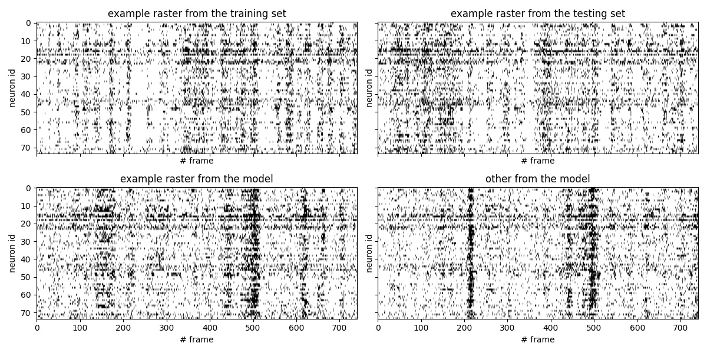

# Sample-and-measure paper

Fitting summary statistics of neural data with a differentiable spiking network simulator  
Guillaume Bellec*, Shuqi Wang*, Alireza Modirshanechi, Johanni Brea^, Wulfram Gerstner^  
  

Accepted for publication at the NeurIPS conference 2021  
(*= equal contributions, ^ = senior authors)  
[arxiv](https://arxiv.org/abs/2106.10064)  

## Environment

```
conda create -n rsnn_SM python=3.8
conda activate rsnn_SM
conda install pip
pip install -r requirements.txt
```

## Execution example

```
python train.py --SEED=0 --ground_truth=no  --GPU=yes --maxiter=800
```


The default parameters defined in `src.parser.py` should match the parameters used in the paper.


#### Dataset

To reproduce the results on the V1-dataset, download it at: https://crcns.org/data-sets/vc/pvc-11/about.
Then the instructions to pre-process the data and convert it from `.mat` to `.npy` as detailed in the notebook: `convert_data_to_npy.ipynb` or in the Appendix A of our paper.

The processed data should be saved in the folder `data_dir` specified in `src.parser.py`.
The video data should be saved as a numpy array of shape: ( #pixel_y, #pixel_x, #frame ).
The spike train aligned to the video should be saved in the form of numpy array of shape: ( #repetition * #frame, #neuron).
Similar video spike trains should be saved for validating testing sets, they correspond here to different repetitions of the same movie.
Once the `.npy` file generated, the `DataLoader` in `src.utils.py` handles the preprocessing and the data.

#### Forcasting

Once a model is trained, one can use `forcast.py` to simulate spike train samples. It should save generated spike trains and draw raster plots of the following type:

